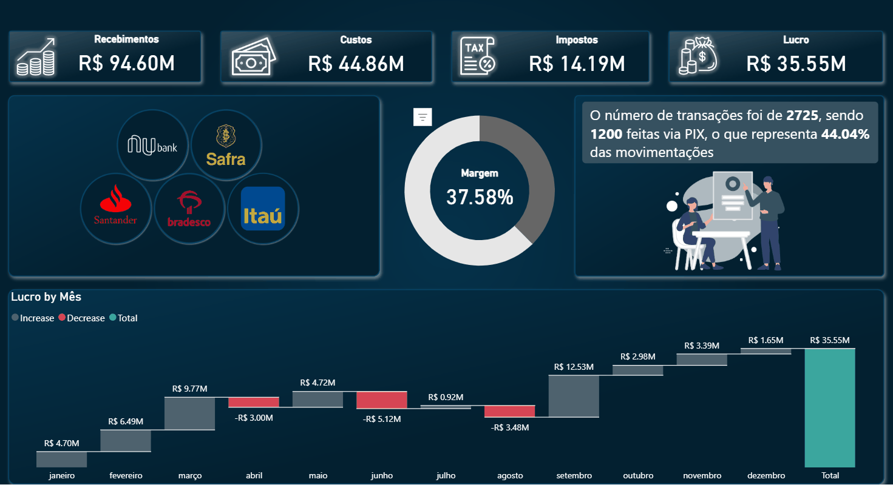

# 📊 Dashboard de Performance Financeira e Meios de Pagamento

Projeto de Business Intelligence desenvolvido para monitorar indicadores financeiros, rentabilidade e comportamento das transações realizadas por diferentes instituições bancárias.

O dashboard foi construído utilizando Power BI e permite analisar receitas, custos, impostos, lucro operacional e participação dos meios de pagamento, transformando dados financeiros em informações estratégicas para apoio à tomada de decisão.

---

## 🌐 Dashboard Interativo

👉 **Acesse o relatório online:**

https://app.powerbi.com/view?r=eyJrIjoiZTNjNWFjMmQtM2RkZi00YmIyLWI1NjYtZjBkZTUwZjczZDhhIiwidCI6ImM3ZDQ0MTJiLWNmYTctNGM5Mi1iOGE1LTZmZGFkOTllYTk2MiJ9

---

## 📷 Visão Geral do Dashboard


---

## 🎬 Demonstração Interativa



---

## 🎯 Objetivos do Projeto

* Monitorar indicadores financeiros estratégicos;
* Avaliar a rentabilidade da operação;
* Analisar receitas, custos e impostos;
* Acompanhar o desempenho financeiro ao longo dos meses;
* Identificar padrões de utilização dos meios de pagamento;
* Apoiar decisões orientadas por dados financeiros.

---

## 📈 Indicadores (KPIs)

* Recebimentos Totais;
* Custos Operacionais;
* Impostos;
* Lucro Líquido;
* Margem Operacional;
* Quantidade de Transações;
* Participação de Transações PIX.

---

## 💡 Principais Análises

* Comparação entre receitas, custos e lucro;
* Avaliação da margem operacional da empresa;
* Identificação da participação do PIX nas movimentações financeiras;
* Análise da distribuição das transações por instituição bancária;
* Monitoramento da evolução do lucro ao longo dos meses;
* Apoio ao planejamento financeiro baseado em indicadores.

---

## 🚀 Solução Desenvolvida

### Modelagem Financeira

Estruturação dos dados para análise integrada de receitas, despesas, impostos e resultados financeiros.

### ETL e Transformação de Dados

Tratamento e preparação dos dados utilizando Power Query para garantir consistência e qualidade das informações.

### Desenvolvimento de KPIs

Criação de indicadores financeiros e medidas DAX para acompanhamento da rentabilidade e desempenho operacional.

### Interatividade por Instituição Bancária

Implementação de filtros interativos através das instituições financeiras, permitindo análises segmentadas por banco e facilitando a exploração dos dados.

### Análise de Meios de Pagamento

Monitoramento da participação das transações realizadas via PIX e sua representatividade no total das movimentações.

### Visualização de Dados

Construção de dashboard executivo com foco em análise financeira, storytelling e suporte à tomada de decisão.

---

## 🛠️ Tecnologias Utilizadas

* Power BI Desktop
* Power Query
* DAX
* Modelagem de Dados
* ETL
* Data Visualization
* Business Intelligence

---

## 📂 Estrutura do Projeto

```text
dashboard-financeiro-powerbi/
│
├── Dashboard_Financeiro.pbix
├── dashboard-financeiro.png
├── Gif-dashboard.gif
├── README.md
└── dataset/
```

---

## 📚 Competências Aplicadas

* Business Intelligence
* Power BI
* Power Query
* DAX
* ETL
* Modelagem de Dados
* Data Analytics
* Data Visualization
* Storytelling com Dados
* Indicadores Financeiros
* Análise Financeira
* Análise de Rentabilidade
* KPI Management
* Dashboards Executivos

---

## 👨‍💻 Autor

**Chris Alex Borges de Santana Januário**

🔗 LinkedIn: https://www.linkedin.com/in/chrisjanuario

🔗 GitHub: https://github.com/7alexch
